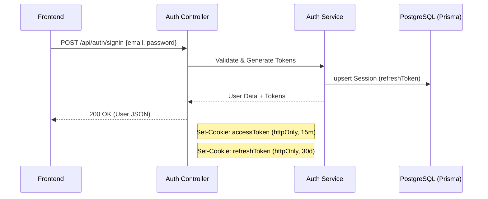
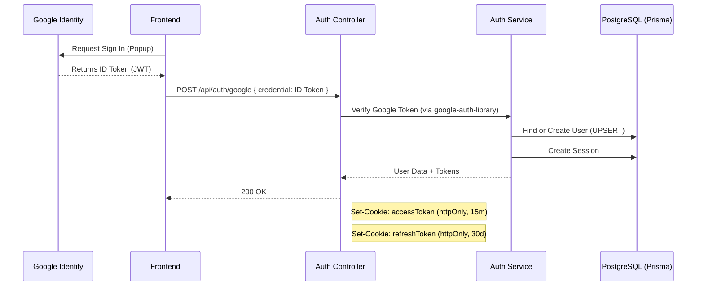

# Authentication Feature Flow

> **Last Updated:** 2026-02-23
> **Feature:** Authentication & Session Management
> **Components:** JWT, HttpOnly Cookies, Google OAuth (GIS), Prisma
> **Status:** Implemented

This document details the secure authentication mechanism used in the Erion Raven application, including standard Email/Password flow and Google Sign-In. Both methods result in generic JWTs stored in HTTP-Only cookies.

## Overview

The authentication system is designed to be secure and stateless (for access) while maintaining control over long-term sessions.

- **Access Token:** Short-lived (15 minutes), stateless JWT used for API authorization. Stored in an `httpOnly` cookie.
- **Refresh Token:** Long-lived (30 days), stateful token stored in the database (`Session` model) and an `httpOnly` cookie. Used to obtain new access tokens.
- **Google Sign-In:** Uses Google Identity Services (GIS) to verify identity, then maps to an internal User record.
- **Security:** CSRF protection via SameSite cookies (`lax` in dev, `strict`/`lax` in prod). XSS protection by making cookies inaccessible to JavaScript.

## Architecture & Data Flow

### 1. Sign Up & Sign In Flow (Email)



### 2. Google Sign-In Flow



## Database Schema (Prisma)

### User Model

```prisma
model User {
  id           String    @id @default(cuid())
  username     String    @unique
  email        String    @unique
  password     String?
  avatar       String?
  createdAt    DateTime  @default(now())
  updatedAt    DateTime  @updatedAt
}
```

### Session Model

```prisma
model Session {
  id           String    @id @default(cuid())
  userId       String
  refreshToken String    @unique
  expiresAt    DateTime
  createdAt    DateTime  @default(now())
}
```

## API Endpoints

Base Route: `/api/v1/auth`

| Route | Endpoint | Description | Method |
|-------|----------|-------------|--------|
| `/signup` | `/api/v1/auth/signup` | Register a new user | `POST` |
| `/signin` | `/api/v1/auth/signin` | Sign in a user | `POST` |
| `/google` | `/api/v1/auth/google` | Sign in with Google | `POST` |
| `/refresh` | `/api/v1/auth/refresh` | Refresh access token | `POST` |
| `/signout` | `/api/v1/auth/signout` | Sign out a user | `POST` |

## Related Documentation

- **[Database Design](./DATABASE_DESIGN.md)**
- **[High-Level Architecture](./HIGH_LEVEL_DESIGN.md)**

