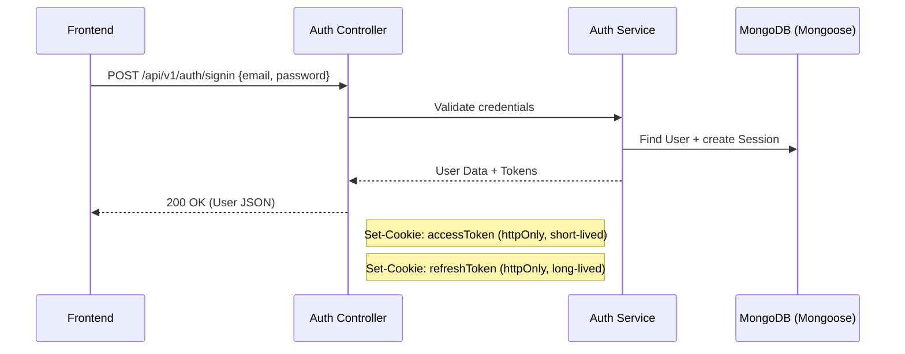
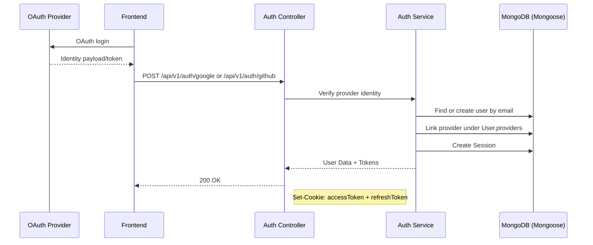

# Authentication Feature Flow

> **Last Updated:** 2026-04-06
> **Feature:** Authentication & Session Management
> **Components:** JWT, HttpOnly Cookies, Google OAuth (GIS), GitHub OAuth, MongoDB (Mongoose)
> **Status:** Implemented

This document describes authentication in Erion Raven, including email/password and OAuth login flows. Both flows produce JWT credentials delivered via HTTP-only cookies, with refresh sessions persisted in MongoDB.

## Overview

The authentication system is split between short-lived stateless access tokens and persisted refresh sessions.

- **Access Token:** Short-lived JWT (`15m` by default) used for API authorization.
- **Refresh Token:** Long-lived random token (`30d` by default) stored in the `Session` collection and an `httpOnly` cookie.
- **OAuth Sign-In:** Google and GitHub profiles are resolved/linked into `User.providers`.
- **Cookie Security:** `httpOnly`, environment-aware `secure`, and `sameSite` settings.

## Architecture & Data Flow

### 1. Sign Up & Sign In Flow (Email)



### 2. Google/GitHub OAuth Flow



## MongoDB Collections (Mongoose Models)

### User Model (`apps/api/src/models/User.ts`)

```typescript
interface IUser {
  username: string;
  email: string;
  password?: string;
  avatar?: string;
  providers: Array<{
    name: 'google' | 'github';
    providerId: string;
    email: string;
    avatar?: string;
    linkedAt: Date;
  }>;
  createdAt: Date;
  updatedAt: Date;
}
```

### Session Model (`apps/api/src/models/Session.ts`)

```typescript
interface ISession {
  userId: ObjectId;
  refreshToken: string;
  expiresAt: Date;
  createdAt: Date;
  updatedAt: Date;
}
```

## API Endpoints

Base Route: `/api/v1/auth`

| Endpoint | Description | Method |
|----------|-------------|--------|
| `/signup` | Register a new user | `POST` |
| `/signin` | Sign in with email/password | `POST` |
| `/google` | Sign in with Google OAuth | `POST` |
| `/github` | Sign in with GitHub OAuth | `POST` |
| `/refresh` | Refresh access token | `POST` |
| `/signout` | Sign out a user | `POST` |

## Related Documentation

- **[Database Design](./DATABASE_DESIGN.md)**
- **[High-Level Architecture](./HIGH_LEVEL_DESIGN.md)**
