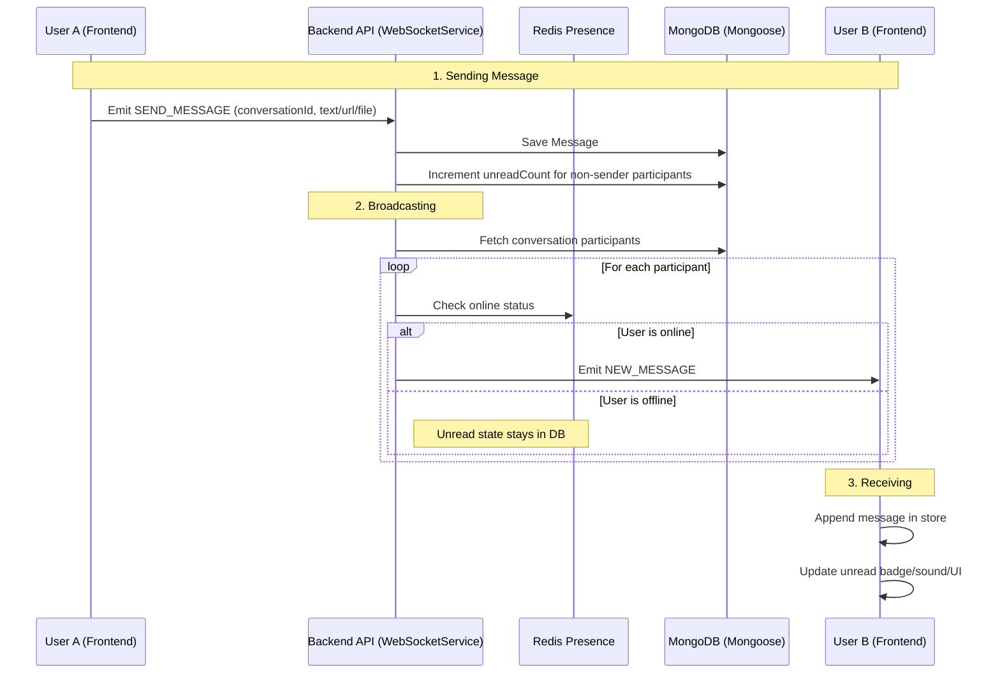

# Real-time Chat Feature Flow

> **Last Updated:** 2026-04-06
> **Feature:** Real-time Messaging
> **Components:** WebSocket, Redis, MongoDB (Mongoose), API
> **Status:** Implemented

This document describes the architecture of real-time chat features for user-to-user and group messaging.

## Overview

The real-time chat system is built on **Socket.IO** for bidirectional communication. It uses **Redis** for online status and room-presence state, while **MongoDB (via Mongoose)** stores persistent messages and participant unread counters.

## Architecture & Data Flow

### 1. Message Sending Flow



## Redis Global State

Redis tracks active users and conversation room memberships.

| Key Pattern | Data Type | Purpose |
| :--- | :--- | :--- |
| `online_users:{userId}` | String | Presence flag with timestamp |
| `user_rooms:{userId}` | Set | Conversations currently joined by the user |

### Shared State Operations

- On connect: `SET online_users:{userId} {ISO_DATE}`
- On disconnect: `DEL online_users:{userId}`
- On room join: `SADD user_rooms:{userId} {conversationId}`
- On room leave: `SREM user_rooms:{userId} {conversationId}`

---

## API Endpoints

### Message Management

Base Route: `/api/v1/messages`

| Endpoint | Method | Description |
|----------|--------|-------------|
| `/` | `POST` | Send message |
| `/conversation/:id` | `GET` | Get paginated message history |
| `/:id` | `DELETE` | Soft-delete a message |

### WebSocket Management

Base Route: `/api/v1/ws`

| Endpoint | Method | Description |
|----------|--------|-------------|
| `/stats` | `GET` | WebSocket system stats |
| `/users` | `GET` | List connected user IDs |

---

## Code Example

**File:** `apps/api/src/services/websocket.service.ts`

```typescript
const savedMessage = await this.messageService.createMessage(senderId, messageData);

await Participant.updateMany(
  { conversationId, userId: { $ne: senderId }, deletedAt: null },
  { $inc: { unreadCount: 1 } }
);

const participants = await Participant.find({ conversationId, deletedAt: null }).select('userId');

for (const participant of participants) {
  const userId = participant.userId.toString();
  if (this.isOnline(userId)) {
    this.emitToUser(userId, SocketEvent.NEW_MESSAGE, messageDto);
  }
}
```

## Related Documentation

- **[Unread Message Feature](./UNREAD_MESSAGE_FEATURE.md)**
- **[Database Design](./DATABASE_DESIGN.md)**
- **[Relationship Feature](./RELATIONSHIP_FEATURE.md)**
