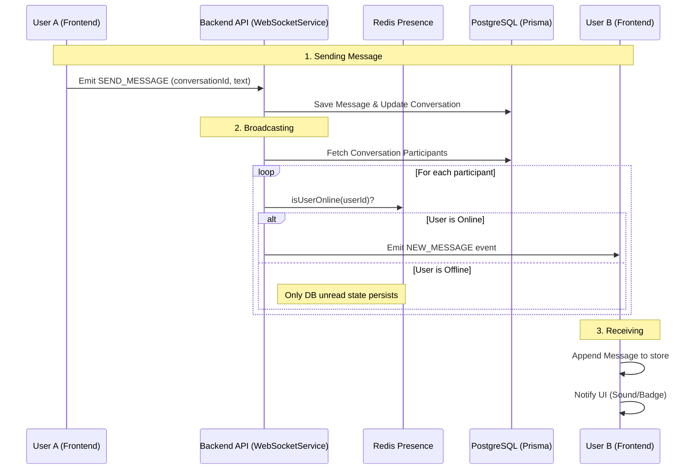

# Real-time Chat Feature Flow

> **Last Updated:** 2026-02-23
> **Feature:** Real-time Messaging (Standard & AI)
> **Components:** WebSocket, Redis, PostgreSQL (Prisma), API
> **Status:** Implemented

This document details the architecture and implementation of the real-time chat features, including traditional messaging and AI-powered interactions.

## Overview

The real-time chat system is built on **Socket.IO** for bidirectional communication. It uses **Redis** for presence tracking and **PostgreSQL (via Prisma)** for persistent message storage and participant state management.

## Architecture & Data Flow

### 1. Message Sending Flow

The flow ensures that all participants in a conversation receive the message in real-time if they are online.



## Redis Global State

Redis tracks which users are currently "active" and which "rooms" (conversations) they are viewing.

| Key Pattern | Data Type | Purpose |
| :--- | :--- | :--- |
| `online_users:{userId}` | String | Presence flag with timestamp |
| `user_rooms:{userId}` | Set | List of IDs the user is currently looking at |

### Shared State Operations

- **On Connect:** `SET online_users:{userId} {ISO_DATE}`
- **On Disconnect:** `DEL online_users:{userId}`
- **On Room Join:** `SADD user_rooms:{userId} {conversationId}`
- **On Room Leave:** `SREM user_rooms:{userId} {conversationId}`

---

## API Endpoints

### Message Management

Base Route: `/api/v1/messages`

| Endpoint | Method | Description |
|----------|--------|-------------|
| `/` | `POST` | Send message (User or AI) |
| `/conversation/:id` | `GET` | Get message history (Paginated) |
| `/:id` | `DELETE` | Soft delete a message |

### WebSocket Management

Base Route: `/api/v1/ws`

| Endpoint | Method | Description |
|----------|--------|-------------|
| `/stats` | `GET` | System-wide socket stats |
| `/users` | `GET` | List all connected user IDs |

---

## Code Examples

### Backend: Broadcasting Message

**File:** `apps/api/src/services/websocket.service.ts`

```typescript
// Core broadcasting logic
async handleSendMessage(senderId: string, payload: any) {
  // 1. Persist via Prisma
  const message = await this.messageService.createMessage(senderId, payload);
  
  // 2. Fetch recipients
  const participants = await this.prisma.conversation.findUnique({
    where: { id: payload.conversationId },
    select: { participants: true }
  });

  // 3. Emit to online participants
  for (const part of participants) {
    if (await this.presenceService.isOnline(part.userId)) {
      this.io.to(part.userId).emit('new_message', message);
    }
  }
}
```

## Related Documentation

- **[Unread Message Feature](./UNREAD_MESSAGE_FEATURE.md)**
- **[Database Design](./DATABASE_DESIGN.md)**
- **[AI Features](./CONVERSATION_FEATURE.md)**
