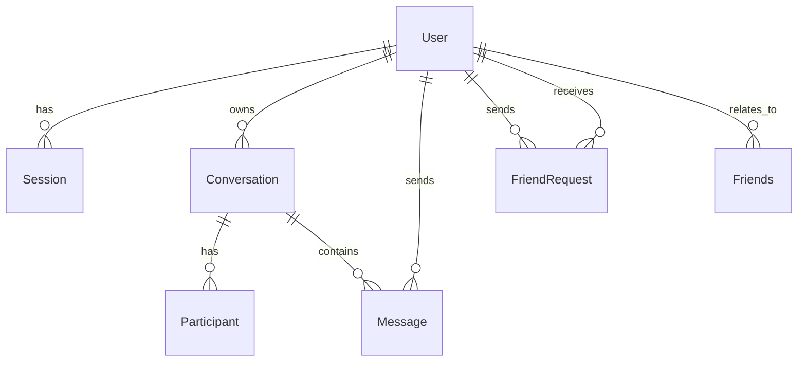

# Database Schema

> **Last Updated:** 2026-04-06
> **Feature:** Database Design & Schema
> **Components:** MongoDB, Mongoose ODM
> **Status:** Implemented

## 🎯 Overview

The **erion-raven** backend uses **MongoDB** as its primary database and **Mongoose** as the ODM. Data is modeled around users, conversations, participants, messages, auth sessions, and relationship workflows.

### Design Principles

- **Document IDs:** MongoDB ObjectId-based identifiers.
- **Timestamps:** Most models use `timestamps: true` for `createdAt` / `updatedAt`.
- **Soft Deletes:** Core chat models include `deletedAt` for logical deletion.
- **Index-First Access Patterns:** Models define indexes for common read/write paths.
- **Schema Flexibility:** Provider-linked identity fields allow controlled OAuth profile syncing.

---

## 📊 Collections

| Collection / Model | Purpose | Key Relationships |
|--------------------|---------|-------------------|
| `User` | Core identity/profile | Referenced by sessions, conversations, messages, profiles |
| `Session` | Refresh token persistence | Belongs to `User` (`userId`) |
| `Conversation` | Chat container (direct/group) | Owned by `User`, referenced by participants/messages |
| `Participant` | Membership + unread/read state | Links `User` and `Conversation` |
| `Message` | Message documents | Belongs to `User` (`senderId`) and `Conversation` |
| `FriendRequest` | Friend request workflow state | Links two users (`fromUserId`, `toUserId`) |
| `Friends` | Established friendship edge | Links two users (`userId`, `friendId`) |

---

## 🗺️ Entity Relationship Diagram



---

## 📝 Model Details

### User

```typescript
interface IUser {
  _id: ObjectId;
  username: string;
  email: string;
  password?: string;
  avatar?: string;
  providers: Array<{
    name: 'google' | 'github';
    providerId: string;
    email: string;
    avatar?: string;
    linkedAt: Date;
  }>;
  createdAt: Date;
  updatedAt: Date;
  deletedAt?: Date | null;
}
```

### Session

```typescript
interface ISession {
  _id: ObjectId;
  userId: ObjectId;
  refreshToken: string;
  expiresAt: Date;
  createdAt: Date;
  updatedAt: Date;
}
```

### Conversation

```typescript
interface IConversation {
  _id: ObjectId;
  name: string;
  ownerId: ObjectId;
  type: 'DIRECT' | 'GROUP';
  avatar?: string;
  createdAt: Date;
  updatedAt: Date;
  deletedAt?: Date | null;
}
```

### Participant

```typescript
interface IParticipant {
  _id: ObjectId;
  userId: ObjectId;
  conversationId: ObjectId;
  joinedAt: Date;
  unreadCount: number;
  lastReadAt: Date;
  deletedAt?: Date | null;
}
```

### Message

```typescript
interface IMessage {
  _id: ObjectId;
  senderId: ObjectId;
  conversationId?: ObjectId;
  text?: string;
  url?: string;
  fileName?: string;
  isArchived?: boolean;
  createdAt: Date;
  updatedAt: Date;
  deletedAt?: Date | null;
}
```

---

## ⚡ Indexes

The current model layer defines indexes to support common query paths:

- `User`: `deletedAt`
- `Conversation`: `ownerId`, `deletedAt`, `type`
- `Message`: `(conversationId, createdAt desc)`, `senderId`, `deletedAt`
- `Participant`: unique `(userId, conversationId)`, plus `conversationId`
- `Session`: `userId`, unique `refreshToken`, `expiresAt`
- `FriendRequest`: unique `(fromUserId, toUserId)`, plus status-related indexes
- `Friends`: unique `(userId, friendId)`

---

## 🔄 Schema Evolution & Maintenance

- Schema changes are handled by updating model definitions in `apps/api/src/models`.
- New indexes should be added in model files based on query patterns.
- Backfill scripts (if required) should be added under `apps/api/src/scripts` and run in controlled environments.

---

## 📚 Related Documentation

- **[High-Level Architecture](./HIGH_LEVEL_DESIGN.md)**
- **[Authentication Feature](./AUTH_FEATURE.md)**
- **[Chat Realtime Feature](./CHAT_REALTIME_FEATURE.md)**
