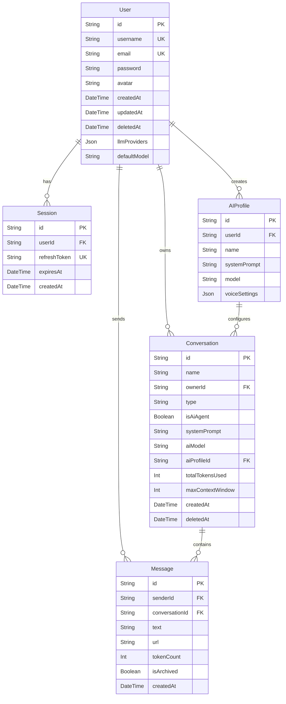

# Database Schema

> **Last Updated:** 2026-02-23
> **Feature:** Database Design & Schema
> **Components:** PostgreSQL, Prisma ORM
> **Status:** Implemented

## 🎯 Overview

The **erion-raven** application uses PostgreSQL as its primary database with Prisma as the ORM. The schema is optimized for real-time messaging, AI chatbot interactions, and secure user management.

### Design Principles

- **Primary Keys:** Uses `cuid()` for globally unique, sortable String IDs.
- **Timestamps:** Every model includes `createdAt` and `updatedAt` (auto-managed by Prisma).
- **Soft Deletes:** Key models (`User`, `Conversation`, `Message`) include a `deletedAt` field for logical deletion.
- **Relational Integrity:** Foreign key constraints and cascading deletes are enforced at the database level.
- **JSON Support:** Specific fields (like `llmProviders` and `voiceSettings`) use native PostgreSQL JSONB for flexibility.

---

## 📊 Models

| Model | Purpose | Key Relationships |
|-------|---------|-------------------|
| `User` | Core identity and profile | Root for `Session`, `Conversation`, `Message`, `AIProfile` |
| `Session` | JWT refresh token management | Belongs to `User` |
| `Conversation` | Chat rooms (Direct/Group/AI) | Owned by `User`, Contains `Message` |
| `Message` | Individual chat entries | Sent by `User`, belongs to `Conversation` |
| `AIProfile` | Presets for AI assistants | Created by `User`, used by `Conversation` |

---

## 🗺️ Entity Relationship Diagram



---

## 📝 Model Details

### 1. User
Stores account credentials, profile settings, and AI provider configurations.

```prisma
model User {
  id           String    @id @default(cuid())
  username     String    @unique
  email        String    @unique
  password     String?
  avatar       String?
  llmProviders Json?
  defaultModel String?
  createdAt    DateTime  @default(now())
  updatedAt    DateTime  @updatedAt
  deletedAt    DateTime?
}
```

### 2. Conversation
Represents a chat session. Can be a standard group/direct chat or an AI-powered assistant session.

```prisma
model Conversation {
  id               String    @id @default(cuid())
  name             String
  ownerId          String
  type             String    @default("GROUP")
  isAiAgent        Boolean   @default(true)
  systemPrompt     String?
  aiModel          String?
  aiProfileId      String?
  totalTokensUsed  Int?
  maxContextWindow Int?
  createdAt        DateTime  @default(now())
}
```

---

## 🔄 Migration & Maintenance

### Schema Changes
Prisma Migrate is used for all DDL operations:

```bash
# Create and apply a migration
npx prisma migrate dev --name describe_change

# Apply to production
npx prisma migrate deploy
```

### Seed Data
Initial system configurations and test users are managed via the seeding script:
`apps/api/prisma/seed.ts`

---

## 📚 Related Documentation

- **[High-Level Architecture](./HIGH_LEVEL_DESIGN.md)**
- **[Authentication Feature](./AUTH_FEATURE.md)**
- **[Chat Realtime Feature](./CHAT_REALTIME_FEATURE.md)**
