# System Architecture

> **Last Updated:** 2026-04-06
> **Feature:** System Architecture
> **Components:** Frontend, Backend, Database (MongoDB), Redis
> **Status:** Implemented

## 🎯 Overview

**erion-raven** is a real-time chat application built with a monorepo architecture.

- Real-time messaging with WebSocket (Socket.IO)
- Direct and group conversations
- MongoDB (via Mongoose) for core application data
- Redis for presence tracking and fast ephemeral state

---

## 🏗️ High-Level Architecture

```mermaid
graph TB
    subgraph "Client Layer"
        WEB[Web App<br/>React + Vite]
    end

    subgraph "API Gateway"
        API[Express API Server<br/>Port 8080]
        WS[Socket.IO Server<br/>WebSocket]
    end

    subgraph "Services Layer"
        AUTH[Auth Service]
        USER[User Service]
        CONV[Conversation Service]
        MSG[Message Service]
        PRES[Presence Service]
        WSVC[WebSocket Service]
    end

    subgraph "Data Layer"
        MONGO[(MongoDB<br/>Primary Database)]
        MONGOOSE[Mongoose ODM]
        REDIS[(Redis<br/>Presence & Cache)]
    end

    WEB -->|HTTP/HTTPS| API
    WEB -->|WebSocket| WS

    API --> AUTH
    API --> USER
    API --> CONV
    API --> MSG

    WS --> WSVC
    WSVC --> PRES

    AUTH --> MONGOOSE
    USER --> MONGOOSE
    CONV --> MONGOOSE
    MSG --> MONGOOSE

    MONGOOSE --> MONGO
    PRES --> REDIS

    style WEB fill:#61dafb
    style API fill:#68a063
    style WS fill:#010101
    style MONGO fill:#47a248
    style REDIS fill:#dc382d
```



---

## 📦 Monorepo Structure

```text
erion-raven/
├── apps/
│   ├── api/                    # Backend API (Node.js + Express)
│   │   ├── docs/               # Swagger/OpenAPI definition
│   │   └── src/
│   │       ├── config/         # App, DB, Redis, auth config
│   │       ├── controllers/    # Request handlers
│   │       ├── middleware/     # Express/Socket middleware
│   │       ├── models/         # Mongoose models
│   │       ├── routes/         # API routes
│   │       ├── services/       # Business logic
│   │       └── utils/          # Shared backend helpers
│   │
│   └── web/                    # Frontend (React + Vite)
│       └── src/
│           ├── components/     # UI components
│           ├── hooks/          # Custom React hooks
│           ├── store/          # Zustand state management
│           └── pages/          # Route-level views
│
├── packages/
│   ├── shared/                 # Shared utilities
│   ├── types/                  # Shared TypeScript types
│   └── validators/             # Shared validation schemas
│
└── _docs/                      # Project documentation
```

---

## 🛠️ Technology Stack

| Technology | Purpose |
|------------|---------|
| **MongoDB** | Primary application data store |
| **Mongoose** | ODM for schema modeling and data access |
| **Redis** | Real-time presence and room/session state |
| **Socket.IO** | Bi-directional real-time communication |
| **Turborepo** | Monorepo build and pipeline orchestration |

### Backend (`apps/api`)

- Runtime: Node.js 18+
- Framework: Express.js
- Auth: JWT / bcrypt / OAuth strategies

### Frontend (`apps/web`)

- Library: React
- Build Tool: Vite
- Styling: Tailwind CSS + Radix UI
- State: Zustand / TanStack Query

---

## 📚 Related Documentation

- **[Database Design](./DATABASE_DESIGN.md)**
- **[Authentication Feature](./AUTH_FEATURE.md)**
- **[Chat Realtime Feature](./CHAT_REALTIME_FEATURE.md)**
