# System Architecture

> **Last Updated:** 2026-02-23
> **Feature:** System Architecture
> **Components:** Frontend, Backend, Database (PostgreSQL + MongoDB), Redis
> **Status:** Implemented

## 🎯 Overview

**erion-raven** is a real-time chat application with integrated AI capabilities, built with a modern monorepo architecture. The system supports:

- ✅ Real-time messaging with WebSocket (Socket.IO)
- ✅ Direct and Group conversations
- ✅ AI Chatbot integration and profile management
- ✅ Voice interactions (STT/TTS) and 3D Avatars
- ✅ PostgreSQL (via Prisma) for core relational data
- ✅ MongoDB for high-volume AI interaction logs
- ✅ Redis for existence/presence tracking and caching

---

## 🏗️ High-Level Architecture

```mermaid
graph TB
    subgraph "Client Layer"
        WEB[Web App<br/>React + Vite]
    end
    
    subgraph "API Gateway"
        API[Express API Server<br/>Port 8080]
        WS[Socket.IO Server<br/>WebSocket]
    end
    
    subgraph "Services Layer"
        AUTH[Auth Service]
        USER[User Service]
        CONV[Conversation Service]
        MSG[Message Service]
        AI[AI Service]
        PRES[Presence Service]
        WSVC[WebSocket Service]
    end
    
    subgraph "Data Layer"
        PG[(PostgreSQL<br/>Core Database)]
        PRISMA[Prisma ORM]
        MONGO[(MongoDB<br/>AI Logs)]
        REDIS[(Redis<br/>Presence & Cache)]
    end
    
    WEB -->|HTTP/HTTPS| API
    WEB -->|WebSocket| WS
    
    API --> AUTH
    API --> USER
    API --> CONV
    API --> MSG
    API --> AI
    
    WS --> WSVC
    WSVC --> PRES
    
    AUTH --> PRISMA
    USER --> PRISMA
    CONV --> PRISMA
    MSG --> PRISMA
    AI --> PRISMA
    AI --> MONGO
    
    PRISMA --> PG
    PRES --> REDIS
    
    style WEB fill:#61dafb
    style API fill:#68a063
    style WS fill:#010101
    style PG fill:#336791
    style MONGO fill:#47a248
    style REDIS fill:#dc382d
```



---

## 📦 Monorepo Structure

```
erion-raven/
├── apps/
│   ├── api/                    # Backend API (Node.js + Express)
│   │   ├── prisma/            # Prisma Schema & Migrations
│   │   ├── src/
│   │   │   ├── controllers/   # Request handlers
│   │   │   ├── middleware/    # Express middleware
│   │   │   ├── routes/        # API routes
│   │   │   ├── services/      # Business logic (Slim Layer)
│   │   │   └── lib/           # Shared Library (Prisma Client)
│   │
│   └── web/                    # Frontend (React + Vite)
│       ├── src/
│       │   ├── components/    # Atomic Design Components
│       │   ├── hooks/         # Custom React hooks
│       │   ├── store/         # Zustand state management
│       │   └── pages/         # View components
│
├── packages/
│   ├── shared/                 # Shared utilities
│   ├── types/                  # Shared TypeScript types
│   └── validators/             # Shared Zod validation schemas
│
├── docs/                       # Documentation
│   ├── HIGH_LEVEL_DESIGN.md    # This file
│   ├── DATABASE_DESIGN.md     # Prisma & Schema design
│   ├── AUTH_FEATURE.md        # Authentication flows
│   └── ...
```

---

## 🛠️ Technology Stack

### Core Infrastructure

| Technology | Purpose |
|------------|---------|
| **PostgreSQL** | Primary relational data store |
| **Prisma** | Modern Type-safe ORM |
| **Redis** | Real-time presence and existence checking |
| **Socket.IO** | Bi-directional real-time communication |
| **Turborepo** | Monorepo build and pipeline orchestration |

### Backend (`apps/api`)

- **Runtime:** Node.js 24+ (latest LTS)
- **Framework:** Express.js
- **Auth:** JWT / BCrypt
- **AI Integration:** Integration with multiple providers (OpenAI, Anthropic, etc.)

### Frontend (`apps/web`)

- **Library:** React 18+
- **Styling:** Tailwind CSS + Radix UI (shadcn)
- **State:** Zustand / TanStack Query
- **3D:** Three.js / @react-three/fiber (for Virtual Avatars)

---

## 📚 Related Documentation

- **[Database Design](./DATABASE_DESIGN.md)**
- **[Authentication Feature](./AUTH_FEATURE.md)**
- **[Chat Realtime Feature](./CHAT_REALTIME_FEATURE.md)**
