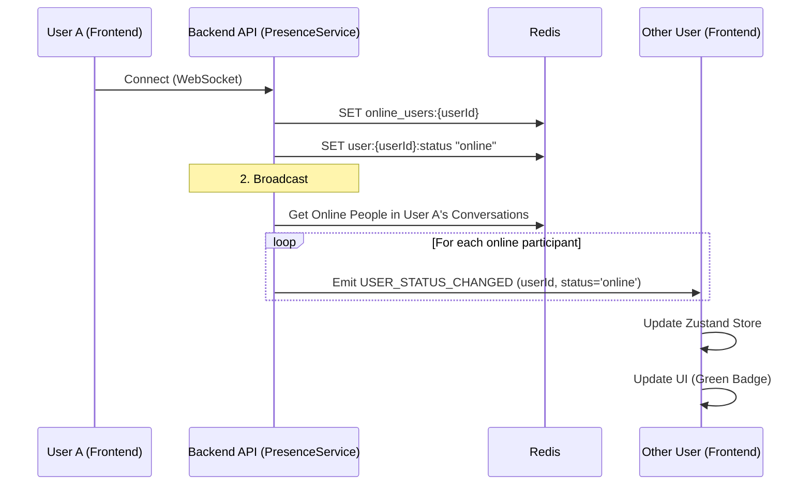
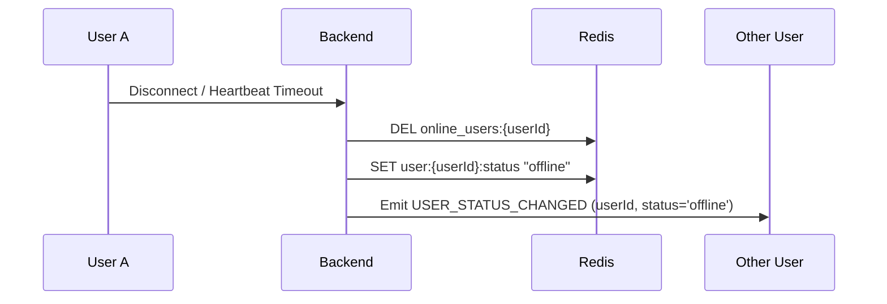

# Online Status Feature Flow

> **Last Updated:** 2026-02-23
> **Feature:** Real-time Presence
> **Components:** WebSocket, Redis, PresenceService
> **Status:** Implemented

This document details the architecture and implementation of the real-time online status system, which tracks user presence and synchronizes it across active conversation partners.

## Overview

The online status system uses a heartbeat-based mechanism backed by **Redis** to track user presence. It ensures that when a user connects or disconnects, their status is broadcasted to relevant users in real-time.

## Architecture & Data Flow

### 1. Connection & Status Broadcast Flow

When a user connects, their status is immediately updated in Redis and broadcasted.

### 2. Disconnection Flow

## Redis Data Structures

| Key Pattern | Data Type | Purpose |
| :--- | :--- | :--- |
| `online_users:{userId}` | String | Presence flag with timestamp |
| `user:{userId}:status` | String | Current status enum (online/offline) |

## Related Documentation

- **[Chat Realtime Feature](./CHAT_REALTIME_FEATURE.md)**
- **[High-Level Architecture](./HIGH_LEVEL_DESIGN.md)**
