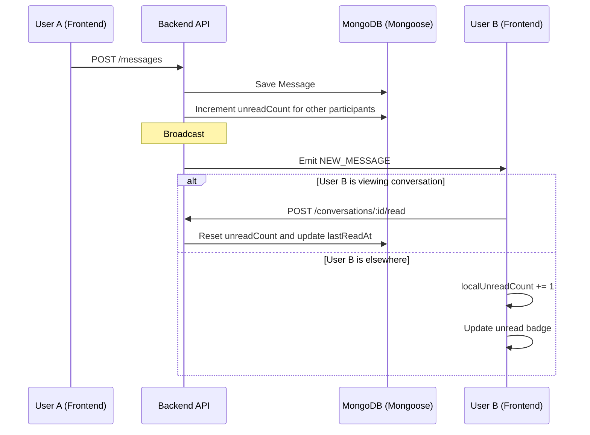

# Unread Message Count & Read Status Flow

> **Last Updated:** 2026-04-06
> **Feature:** Real-time Unread Counts
> **Components:** WebSocket, API, MongoDB (Mongoose)
> **Status:** Implemented

This document explains how unread counts and read status updates work in real time.

## Overview

The system keeps unread state accurate even when users are offline.

1. **DB Persistence:** Unread state is stored per participant in MongoDB (`Participant.unreadCount`, `lastReadAt`).
2. **Real-time Updates:** Socket events are pushed to online participants when new messages are created.
3. **Automatic Marking:** Conversations are marked read when users open/read the conversation.

## Real-time Unread Count Flow

When User A sends a message to User B:

## API Endpoints

### Unread Management

Base Route: `/api/v1/conversations`

| Endpoint | Method | Description |
|----------|--------|-------------|
| `/:id/read` | `POST` | Mark conversation as read |
| `/unread-count` | `GET` | Get total unread count across conversations |

## Related Documentation

- **[Database Design](./DATABASE_DESIGN.md)**
- **[Chat Realtime Feature](./CHAT_REALTIME_FEATURE.md)**
