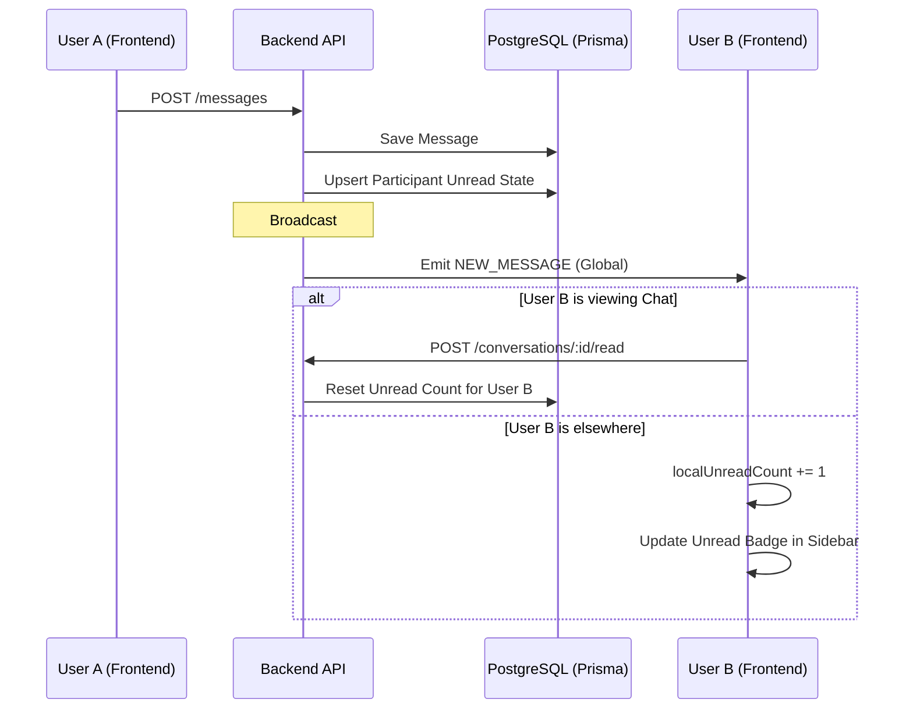

# Unread Message Count & Read Status Flow

> **Last Updated:** 2026-02-23
> **Feature:** Real-time Unread Counts
> **Components:** WebSocket, API, PostgreSQL (Prisma)
> **Status:** Implemented

This document details the architecture and implementation of the real-time unread message tracking and "mark as read" feature.

## Overview

The system ensures that users stay informed about new messages even when they are not actively viewing a conversation.
1.  **DB Persistence:** Unread states are tracked per participant in PostgreSQL.
2.  **Real-time Updates:** Socket events are sent to all online participants when a new message arrives.
3.  **Automatic Marking:** Conversations are marked as read when a user opens them.

## Real-time Unread Count Flow

When User A sends a message to User B:

## API Endpoints

### Unread Management

Base Route: `/api/v1/conversations`

| Endpoint | Method | Description |
|----------|--------|-------------|
| `/:id/read` | `POST` | Mark conversation as read |
| `/unread-count` | `GET` | Get total unread count across all chats |

## Related Documentation

- **[Database Design](./DATABASE_DESIGN.md)**
- **[Chat Realtime Feature](./CHAT_REALTIME_FEATURE.md)**
