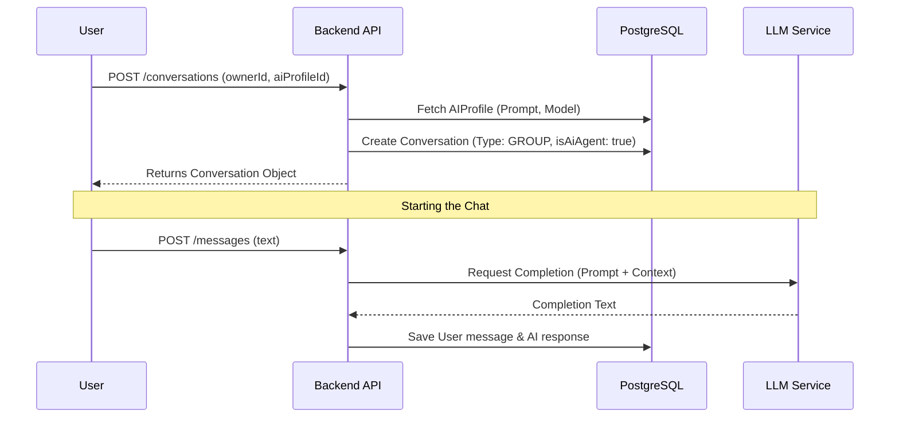
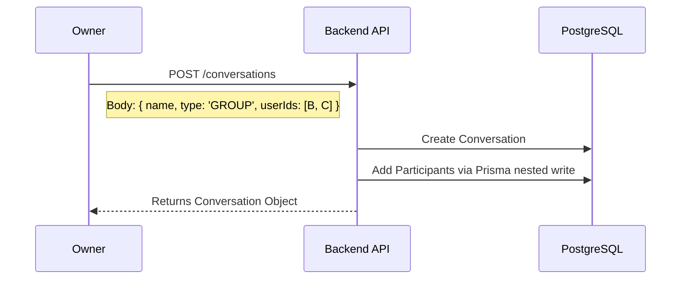

# Conversation & AI Features

> **Last Updated:** 2026-02-23
> **Feature:** Direct, Group, and AI Conversations
> **Components:** Prisma Models, API Services, AI Profiles
> **Status:** Implemented

This document details the workflows for managing conversations, including traditional 1-1/group chats and AI-powered assistant sessions.

## Overview

The system focuses on "Conversations" as the primary container for interaction.
- **DIRECT:** 1-1 chat between two users.
- **GROUP:** Collaborative chat with multiple users.
- **AI AGENT:** An specialized conversation bound to an `AIProfile`, enabling LLM interactions.

## Architecture & Data Flow

### 1. AI Conversation Creation Flow

AI conversations are initialized with a specific system prompt and model configuration.

### 2. Group Conversation Creation Flow

Standard group chats allow multiple human participants.

## API Endpoints

### Conversation Management

Base Route: `/api/v1/conversations`

| Endpoint | Method | Description | Request | Response |
|----------|--------|-------------|---------|----------|
| `/` | `GET` | List user's conversations | None | `Conversation[]` |
| `/` | `POST` | Create new conversation | `{ name, type, userIds, aiProfileId? }` | `Conversation` |
| `/:id` | `GET` | Get details | Params: `id` | `Conversation` |
| `/:id` | `PUT` | Update details | `{ name, systemPrompt? }` | `{ success: true }` |
| `/:id` | `DELETE` | Delete (Soft Delete) | Params: `id` | `{ success: true }` |

### AI Profile Management

Base Route: `/api/v1/ai-profiles`

| Endpoint | Method | Description | Request | Response |
|----------|--------|-------------|---------|----------|
| `/` | `GET` | List user's AI profiles | None | `AIProfile[]` |
| `/` | `POST` | Create profile | `{ name, systemPrompt, model }` | `AIProfile` |
| `/:id` | `DELETE` | Remove profile | Params: `id` | `{ success: true }` |

## Related Documentation

- **[Database Design](./DATABASE_DESIGN.md)**
- **[Chat Realtime Feature](./CHAT_REALTIME_FEATURE.md)**
